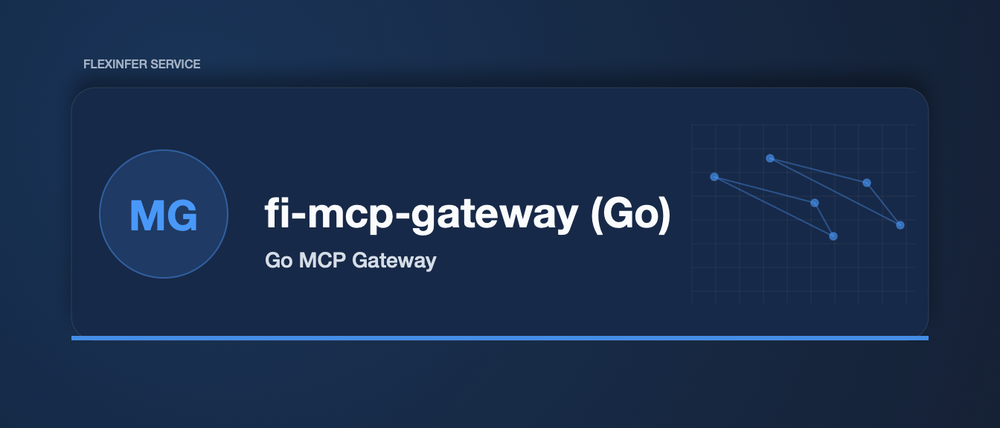

# fi-mcp-gateway (Go)

Go-first MCP Hub gateway service.

This is the Go rewrite of `services/mcp-gateway` (TypeScript), intended to be the enterprise-grade “context gateway”:

- Registry-driven routing (from `registry.yaml`)
- Auth (JWT/OIDC), policy enforcement, audit logging
- Connection pooling per client session
- Metrics + probes for Kubernetes

## Status

Bootstrap in progress: server-bound WS entrypoint + tool-name routing (`server__tool`) with per-session backend connection caching + idle reaping.

## Auth (JWT/OIDC-style JWKS)

Configure via env vars:

- `FI_MCP_AUTH_MODE`: `none` (default), `jwt`, or `oidc` (currently same as `jwt`, using JWKS URL)
- `FI_MCP_AUTH_JWKS_URL`: URL to a JWKS endpoint (required for `jwt`/`oidc`)
- `FI_MCP_AUTH_ISSUER`: expected `iss` (optional)
- `FI_MCP_AUTH_AUDIENCE`: comma-separated acceptable `aud` values (optional)
- `FI_MCP_AUTH_REQUIRED`: `true` (default) rejects missing/invalid tokens; `false` allows anonymous connections

Send tokens via `Authorization: Bearer <jwt>` on the WebSocket upgrade request.

## Policy

Policy is enforced on `tools/call` before forwarding to backends:

- `FI_MCP_POLICY_DEFAULT`: `allow` (default) or `deny`
- `FI_MCP_POLICY_ALLOW_TOOLS`: comma-separated allow patterns (exact, `prefix*`, `*suffix`, or `*`)
- `FI_MCP_POLICY_DENY_TOOLS`: comma-separated deny patterns (deny wins)
- `FI_MCP_POLICY_RESPECT_ALWAYS_ALLOW`: `true` (default) allows tools listed in registry `always_allow` even under default-deny

## REST Tool Invocation

`POST /api/v1/tools/{server}/{tool}` invokes a single MCP tool over a one-shot
backend connection (dial, initialize, `tools/call`, close). The request body is
the tool-arguments JSON object; the response is the raw MCP `CallToolResult`.

The route is keyless (like `GET /api/servers`): the server-side guarantee is the
registry `always_allow` allowlist — only tools listed there for the target server
may be invoked. Status codes:

- `200`: success (body is the `CallToolResult` JSON)
- `400`: request body is not a JSON object
- `403`: tool not in the server's registry `always_allow` (or denied by policy)
- `404`: unknown or local-only server; unknown tool (when static tool schemas are declared)
- `502`: backend unreachable, backend JSON-RPC error, or tool result with `isError: true`

Config:

- `FI_MCP_TOOL_CALL_TIMEOUT`: per-invocation timeout (default `30s`)

## Backend Connection Limits

- `FI_MCP_BACKEND_MAX_IDLE`: max idle backend conns per session/server (default `2`)
- `FI_MCP_BACKEND_MAX_OPEN`: max open backend conns per session/server (default `10`)
- `FI_MCP_BACKEND_IDLE_TIMEOUT`: close idle backend conns (default `5m`)
